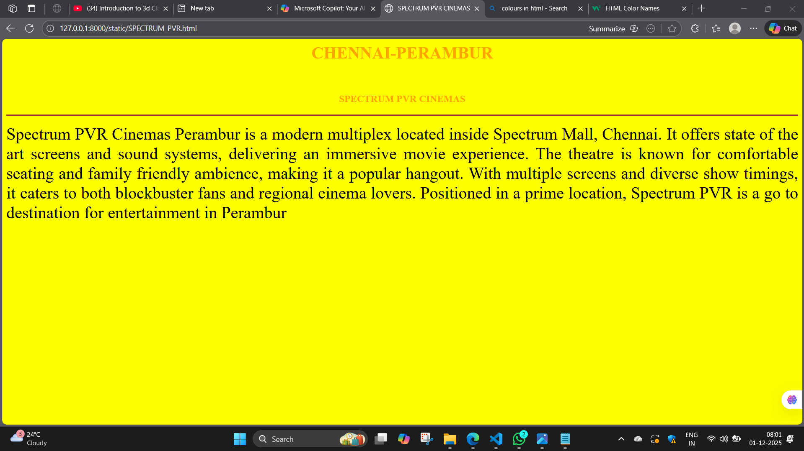
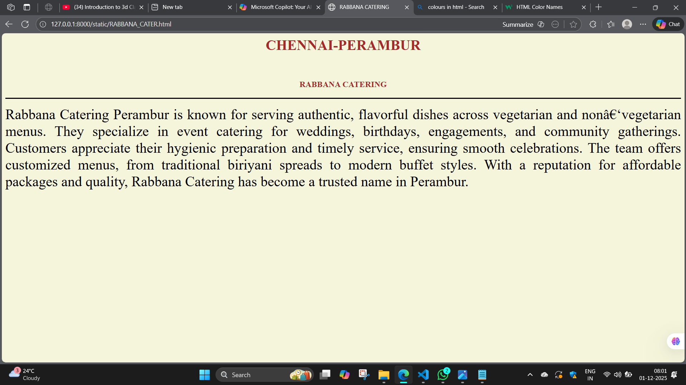
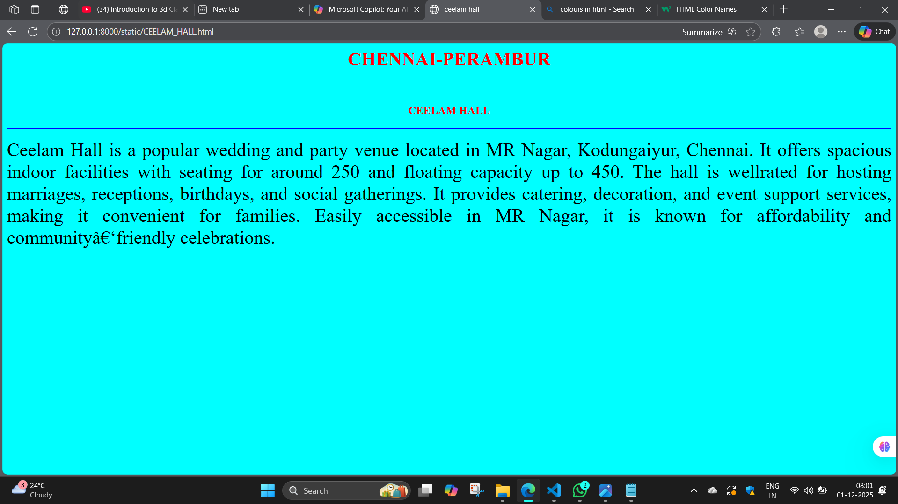
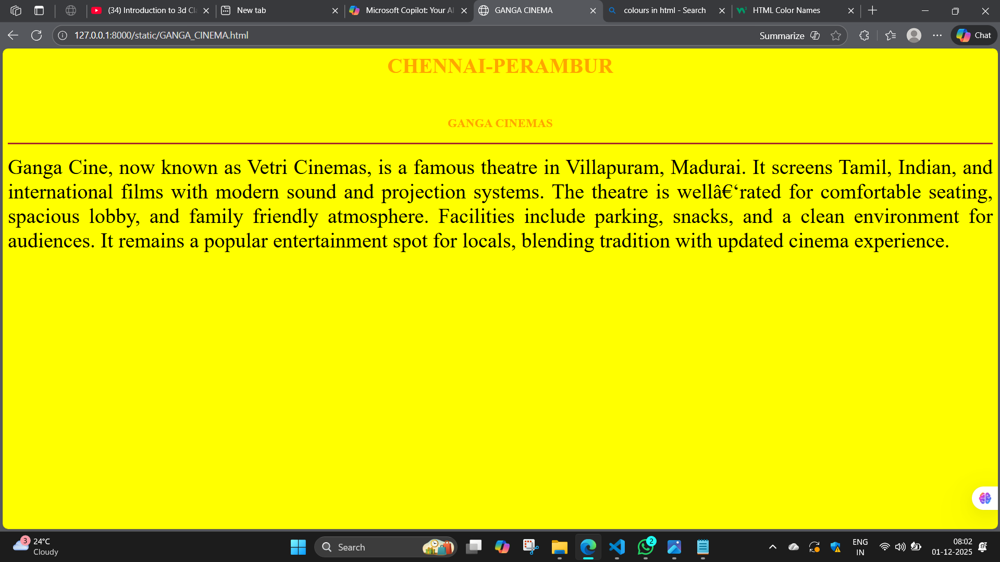
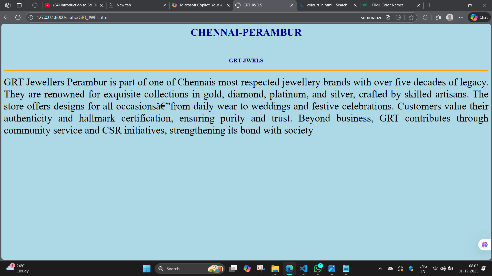

# Ex03 Places Around Me
## Date: 1-12-2025

## AIM
To develop a website to display details about the places around my house.

## DESIGN STEPS

### STEP 1
Create a Django admin interface.

### STEP 2
Download your city map from Google as an image.

### STEP 3
Insert the image using `````` tag and link it to the map.

### STEP 4
Using ```<map>``` tag name the map.

### STEP 5
Create clickable regions in the image using ```<area>``` tag.

### STEP 6
Write HTML programs for all the regions identified.

### STEP 7
Execute the programs and publish them.

## CODE
MAP
```
<html>
    <head>
        <title>MY CITY</title>
    </head>
    <body>
        <header>
            <h1 align="center" color="blue">CHENNAI - PERAMBUR</h1>
            <br>
            <h4 align="center" color="orange">YUVAN RAJ R -25014899</h4>
        </header>
        

<map name="mycity">
    <area target="" alt="SPECTRUM_PVR" title="SPECTRUM_PVR" href="SPECTRUM_PVR.html" coords="809,634,1001,705" shape="rect">
    <area target="" alt="GANGA_CINEMA" title="GANGA_CINEMA" href="GANGA_CINEMA.html" coords="315,253,60" shape="circle">
    <area target="" alt="CEELAM_HALL" title="CEELAM_HALL" href="CEELAM_HALL.html" coords="1257,77,1432,121" shape="rect">
    <area target="" alt="GRT_JWEL" title="GRT_JWEL" href="GRT_JWEL.html" coords="1063,703,1119,686,1173,689,1238,691,1290,696,1280,713,1204,725,1173,742,1189,740,1130,740,1088,733,1104,740,1070,725" shape="poly">
    <area target="" alt="RABBANA_CATER" title="RABBANA_CATER" href="RABBANA_CATER.html" coords="646,173,648,141,718,142,779,146,833,141,819,179,725,179" shape="poly">
</map>
    </body>
</html>
```
REGION 1
```
<html>
    <head>
        <title>ceelam hall</title>

    </head>
    <body bgcolor="cyan">
        <h1 align="center">
            <font color="red"><b>CHENNAI-PERAMBUR</b></font>
        </h1>
        <br>
        <h3 align="center">
            <font color="red"><b>CEELAM HALL</b></font>
        </h3>
        <hr size="3" color="blue">
        <p align="justify">
            <font size="6">
           Ceelam Hall is a popular wedding and party venue located in MR Nagar, Kodungaiyur, Chennai.

It offers spacious indoor facilities with seating for around 250 and floating capacity up to 450.

The hall is wellrated for hosting marriages, receptions, birthdays, and social gatherings.

It provides catering, decoration, and event support services, making it convenient for families.

Easily accessible in MR Nagar, it is known for affordability and community friendly celebrations.
         </font>
        </p>
    </body>
</html>
```
REGION 2
```
<html>
    <head>
        <title>GANGA CINEMA</title>

    </head>
    <body bgcolor="YELLOW">
        <h1 align="center">
            <font color="orange"><b>CHENNAI-PERAMBUR</b></font>
        </h1>
        <br>
        <h3 align="center">
            <font color="orange"><b>GANGA CINEMAS</b></font>
        </h3>
        <hr size="3" color="brown">
        <p align="justify">
            <font size="6">
            Ganga Cine, now known as Vetri Cinemas, is a famous theatre in Villapuram, Madurai.

It screens Tamil, Indian, and international films with modern sound and projection systems.

The theatre is well rated for comfortable seating, spacious lobby, and family friendly atmosphere.

Facilities include parking, snacks, and a clean environment for audiences.

It remains a popular entertainment spot for locals, blending tradition with updated cinema experience.
         </font>
        </p>
    </body>
</html>
```
REGION 3
```
<html>
    <head>
        <title>GRT JWELS</title>

    </head>
    <body bgcolor="lightblue">
        <h1 align="center">
            <font color="darkblue"><b>CHENNAI-PERAMBUR</b></font>
        </h1>
        <br>
        <h3 align="center">
            <font color="darkblue"><b>GRT JWELS</b></font>
        </h3>
        <hr size="3" color="orange">
        <p align="justify">
            <font size="6">
            GRT Jewellers Perambur is part of one of Chennais most respected jewellery brands with over five decades of legacy.

They are renowned for exquisite collections in gold, diamond, platinum, and silver, crafted by skilled artisans.

The store offers designs for all occasions—from daily wear to weddings and festive celebrations.

Customers value their authenticity and hallmark certification, ensuring purity and trust.

Beyond business, GRT contributes through community service and CSR initiatives, strengthening its bond with society
         </font>
        </p>
    </body>
</html>
```
REGION 4
```
<html>
    <head>
        <title>RABBANA CATERING</title>

    </head>
    <body bgcolor="beige">
        <h1 align="center">
            <font color="brown"><b>CHENNAI-PERAMBUR</b></font>
        </h1>
        <br>
        <h3 align="center">
            <font color="brown"><b>RABBANA CATERING</b></font>
        </h3>
        <hr size="3" color="black">
        <p align="justify">
            <font size="6">
            Rabbana Catering Perambur is known for serving authentic, flavorful dishes across vegetarian and non‑vegetarian menus.

They specialize in event catering for weddings, birthdays, engagements, and community gatherings.

Customers appreciate their hygienic preparation and timely service, ensuring smooth celebrations.

The team offers customized menus, from traditional biriyani spreads to modern buffet styles.

With a reputation for affordable packages and quality, Rabbana Catering has become a trusted name in Perambur.
         </font>
        </p>
    </body>
</html>
```
REGION 5
```
<html>
    <head>
        <title>SPECTRUM PVR CINEMAS</title>

    </head>
    <body bgcolor="YELLOW">
        <h1 align="center">
            <font color="orange"><b>CHENNAI-PERAMBUR</b></font>
        </h1>
        <br>
        <h3 align="center">
            <font color="orange"><b>SPECTRUM PVR CINEMAS</b></font>
        </h3>
        <hr size="3" color="brown">
        <p align="justify">
            <font size="6">
            Spectrum PVR Cinemas Perambur is a modern multiplex located inside Spectrum Mall, Chennai.

It offers state of the art screens and sound systems, delivering an immersive movie experience.

The theatre is known for comfortable seating and family friendly ambience, making it a popular hangout.

With multiple screens and diverse show timings, it caters to both blockbuster fans and regional cinema lovers.

Positioned in a prime location, Spectrum PVR is a go to destination for entertainment in Perambur
         </font>
        </p>
    </body>
</html>
```


## OUTPUT
1.


2.


3.


4.


5.


6.



## RESULT
The program for implementing image maps using HTML is executed successfully.
